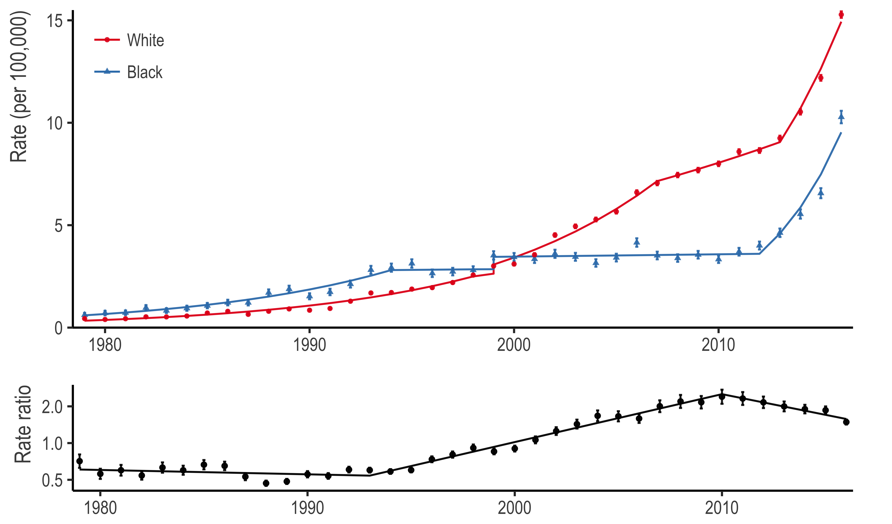

Trends in Black and White Opioid Mortality in the US, 1979-2015
===============================================================

Introduction
============

Reproducible code for our paper ["Trends in Black and White Opioid Mortality in the United States, 1979-2015"](LINK), which uses multiple cause of death data to examine racial differences in opioid mortality over time. The full citation is:

> PAPER CITATION

Issues
------

Please submit issues [via Github](https://github.com/mkiang/opioid_trends/issues) or email.

Requirements
============

Software
--------

We use [`R`](https://cran.r-project.org/) and the [Joinpoint Regression Program](https://surveillance.cancer.gov/joinpoint/) to conduct the analyses in the paper.[1]

-   `R` can be [downloaded here](https://cran.r-project.org/).
-   The Joinpoint Regression Program can be [downloaded here](https://surveillance.cancer.gov/joinpoint/).
-   In addition, we highly recommend the use of RStudio when running `R`. RStudio can be [downlaoded here](https://www.rstudio.com/products/rstudio/download/).

`R` Packages
------------

To run this code, you'll need the following `R` packages from CRAN:

-   `tidyverse`
-   `haven`
-   `doParallel`
-   `foreach`
-   `knitr`
-   `config`
-   `rmarkdown`

In addition, you'll need our package for working with multiple cause of death data, [`narcan`](https://github.com/mkiang/narcan), which is not available on CRAN. If you want to reproduce our figures exactly, you'll need [`patchwork`](https://github.com/thomasp85/patchwork), but the plots can be generated without it.

You can install these packages either by using the `00_install_packages.R` script or by using RStudio to open the `opioid_trends.Rproj` file. Using RStudio is the preferred method as `packrat` will automatically make sure you have the correct version of all necessary packages.

Analysis pipeline
=================

The analysis pipeline is divided into three parts.

-   **Part 1**: Use `R` to download and munge the data, calculate the rates, and output the rates into a format that the Joinpoint Regression Program can take.
-   **Part 2**: Run the joinpoint analyses externally using the output from Part 1.
-   **Part 3**: Ingest the joinpoint regression output and convert it into tables and plots.

Each part has discrete steps and is described in detail below.

Configuation file
-----------------

The `config.yml` file contains several global parameters for the analysis pipeline. Specifically:

-   `delete_zip_orig`: Allows the user to specify if the original MCOD files should be deleted (default: `true`) or saved (`false`) after it has been trimmed in Step 1. These files are typically 75 MB per year.
-   `delete_trimmed`: Allows the user to specify if the smaller MCOD files should be deleted (default: `true`) or saved (`false`) after it has been subsetted in the Step 1. These files are typically around 20 MB per year.
-   `delete_processed:` Allows the user to specify if the uncollapsed MCOD files should be deleted (`true`) or saved (default: `false`) after they have been aggregated in Step 3. These files are typically around 15 MB per year. We save them by default to facilitate additional analyses or debugging; however they are not necessary in terms of purely replicating the published analysis.
-   `start_year` and `end_year`: Specify the start (default: `1979`) and end (default: `2015`) years of the analysis. Going earlier than 1979 will not work (due to different ICD codes), but as new data gets released, going later than 2016 *should* work.
-   `num_decimals`: The number of decimals that should be displayed for Tables 1 and 2
-   `num_decimals_supp`: The number of decimals that should be displayed for the Supplementary Tables
-   `raw_folder`: Specifies where the raw and trimmed MCOD files should be downloaded (default: `'./raw_data'`).
-   `sav_folder`: Specifies where the processed data files (i.e., working data) should be saved (default: `'./data'`).
-   `rmd_folder`: Specifies where `rmarkdown` files, and their output (i.e., tables), should be saved (default: `'./rmds'`).
-   `output_folder`: Specifies where the tables and plots should be saved.
-   `proc_in_parallel`: Specifies if downloading and processing should be performed in parallel (`true`) or serially (default: `false`).

Typically, a user should not need to change any of these parameters; however, on a computer with sufficient RAM, setting `proc_in_parallel` to `true` should result in significant speedup. Be warned that this may result in significant RAM usage (~16 GB of RAM for four processes) and is not recommended for typical computing environments.

Part 1: Getting the data and calculating rates
----------------------------------------------

For convenience, the `./01_rerun_step_1.R` file will run the following files for you in a single step. However, it is recommended you open and inspect each file individually.

-   **Step 1**: `./code/01_download_and_trim_raw_data.R`: Downloads data directly from the NBER website and "trims" the dataset by subsetting only to the columns we will use for analysis. In the `config.yml` file, the user can specify if the raw (untrimmed) data should be kept. The raw data take up approximately 2.9 GB of space (when compressed). The trimmed files take up approximately 900 MB when compressed. When running this process in parallel (that is, setting the `proc_in_parallel` option to `true` in the `config.yml` file), each process consumes 3.5–4 GB of RAM and the default number of processes is half of the available cores. Make sure your computer is capable of this before setting this option to `true`.
    -   Inputs: None
    -   Outputs:
        -   `./raw_data/mortXXXX.dta.zip` or `./raw_data/mortXXXX.csv.zip` (37 files)
        -   `./raw_data/trimmed_mcod_XXXX.RDS` (37 files)
-   **Step 2**: `./code/02_process_trimmed_data.R`: This file will perform basic processing on the trimmed multiple cause of death files. Specifically, it will subset to only US residents, clean ICD-9 data issues, convert the age category, add a Hispanic column if necessary for consistency across years, remap the race categories to be consistent across years, and join contributory cause fields for easier string search.
    -   Inputs: `./raw_data/trimmed_mcod_XXXX.RDS` (37 files)
    -   Outputs: `./data/cleaned_mcod_XXXX.RDS` (37 files)
-   **Step 3**: `./code/03_flag_opioid_deaths.R`: This file will use the underlying cause and contributory cause fields to flag opioid deaths by broad opioid type and when applicable, by ICD-10 type, resulting in our working data set.
    -   Inputs: `./data/cleaned_mcod_XXXX.RDS` (37 files)
    -   Outputs: `./data/working_opioid_data.csv`
-   **Step 4**: `./code/04_calculate_mortality_rates.R`: This file uses the working data to calculate age-specific and age-standardized mortality rates, by opioid type and race.
    -   Inputs: `./data/working_opioid_data.csv`
    -   Outputs:
        -   `./data/age_specific_rates.csv`
        -   `./data/age_standardized_rates_wide.csv`
        -   `./data/age_standardized_rates_long.csv`
-   **Step 5**: `./code/05_calculate_opioid_rate_ratio.R`: This file uses the working data to calculate the ratio (white/black) of the white and black opioid mortality rates.
    -   Inputs: `./data/working_opioid_data.csv`
    -   Outputs: `./data/opioid_rate_ratio.csv`
-   **Step 6**: `./code/06_prepping_data_for_joinpoint.R`: The Joinpoint Regression Program needs the data in a specific shape. This file takes in the files calculated from Steps 4 and 5 and reshapes them into the necessary format.
    -   Inputs:
        -   `./data/age_standardized_rates_long.csv`
        -   `./data/opioid_rate_ratio.csv`
    -   Outputs:
        -   `./joinpoint_analysis/01_opioid_rates_long.csv`
        -   `./joinpoint_analysis/02_opioid_rate_ratio.csv`
        -   `./joinpoint_analysis/03_opioid_rates_by_type.csv`
        -   `./joinpoint_analysis/04_opioid_rates_icd10type.csv`

Part 2: Running joinpoint regressions
-------------------------------------

Part 2 needs to be run outside of `R` using the Joinpoint Regression Program (Windows only). To assist with reproducibility, we provide the original session files (`.jps`), output files (`.jpo`), and all the saved results.

All settings can be inspected by opening the `.jps` file of interest[2] and all results can be reviewed by opening the `.jpo` file. If you would like to conduct the analysis on your own or change some program parameters, simply open the `.jps` file and adjust any settings.

The `./joinpoint_analysis` folder is structured into four analyses, number `01` to `04`. Each one of these analyses contains three files: the original data (`.csv`), the joinpoint session file (`.jps`), and the saved output (`.jpo`). In additoin, each analysis also contains a folder which contains the text-delimited output from the joinpoint regression program.

Part 3: Returning joinpoint results
-----------------------------------

For convenience, the `./02_make_plots_and_tables.R` file will run the following files for you in a single step. However, it is recommended you open and inspect each file individually. Note that we use `rmarkdown` to parse and generate the tables. These `R` scripts below will render the `rmarkdown` files into Microsoft Word files; however, if you would like to see how each file is parsed and sorted, the source of the files are in `./rmds`.

-   **Step 1**: `./code/07_plot_figure1.R`: Generate a `pdf` and `png` of figure 1.
    -   Inputs: Joinpoint results from `01` and `02` analyses.
    -   Outputs:
        -   `fig1_rate_and_ratio.pdf`
        -   `fig1_rate_and_ratio.png`
-   **Step 2**: `./code/08_plot_figure2.R`: Generate a `pdf` and `png` of figure 2.
    -   Inputs: Joinpoint results from `03` analysis.
    -   Outputs:
        -   `fig2_opioid_types.pdf`
        -   `fig2_opioid_types.png`
-   **Step 3**: `./code/09_plot_figure3.R`: Generate a `pdf` and `png` of figure 3.
    -   Inputs: Joinpoint results from `04` analysis.
    -   Outputs:
        -   `fig3_opioid_icd10types.pdf`
        -   `fig3_opioid_icd10types.png`
-   **Step 4**: `./code/10_generate_tables.R`: Generate Microsoft Word documents of Tables 1 and 2.
    -   Inputs:
        -   `./rmds/table1_joinpoint_1979_2015.Rmd`
        -   `./rmds/table2_joinpoint_1999_2015.Rmd`
    -   Outputs:
        -   `./output/table1_joinpoint_1979_2015.docx`
        -   `./output/table2_joinpoint_1999_2015.docx`

In addition, we provide code that will generate the materials in the supplement. See `./code/11_plot_efigure1.R` and `12_generate_supp_tables.R` for more.

Authors
=======

-   [Monica Alexander](http://monicaalexander.com) ([GitHub](https://github.com/MJAlexander))
-   [Magali Barbieri](http://www.demog.berkeley.edu/directories/profiles/barbieri.shtml)
-   [Mathew Kiang](https://mathewkiang.com) ([GitHub](https://github.com/mkiang))

Footnotes
=========

[1] We are investigating ways of reproducing the Joinpoint Regression Program using open-source statistical programs, and may update this code in the future.

[2] You can also open the output file (`.jpo`) and click on "Retreieve Session."
